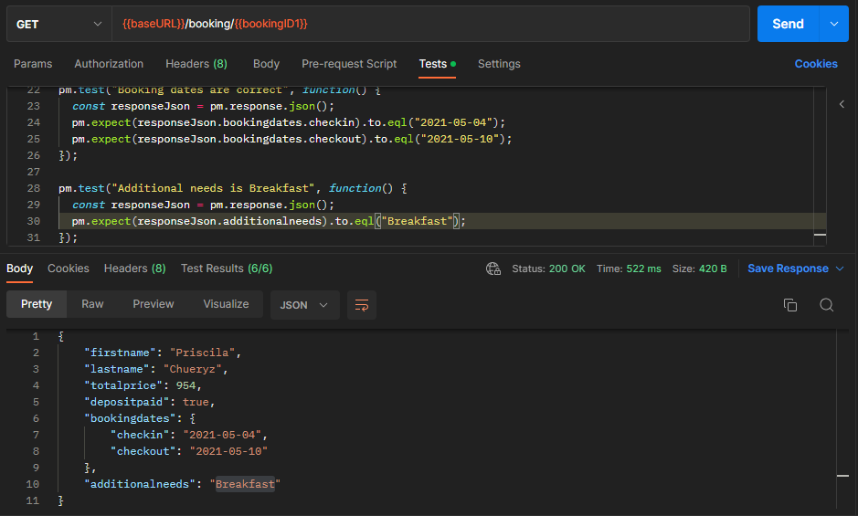

# api-automation-tests-challenge-rest-assured

## Criando uma Collection no Postman utilizando a API Restful-booker.

## Restful-booker API Collection

Inicialmente criei as variáveis da Collection. 

Após criadas as variáveis é a hora de criar o LOGIN para criar um token para acessar a aplicação, usado o método GET  para recuperar essa reserva.

## Auth - Create Token

Para o LOGIN foi usado o POST para a criação do token que será usado para acesso ao PUT e DELETE.


Escrevi um teste para checar o cabeçalho, se recebemos o token além de criar uma variável para armazenar o token recebido e se a resposta é Content-Type JSON.                                                     


## **Booking - CreateBooking**

A criação da reserva também é feita com o POST definido os parâmetros em HEADERS Content-Type e Accept.

No Body os parâmetros:


Em Testes, verificaríamos se recebemos o ID da reserva e se o ID da reserva está armazenado na nova variável ”bookingID1”. A variável é utilizada nos testes seguintes que verificam se o usuário pode editar, receber e deletar a reserva, além de verificarmos se o tipo de conteúdo é JSON e se cada parâmetro é válido.


## **Booking - GetBooking**

Retorna uma reserva específica com base no ID de reserva fornecido.

Usei a variável de URL e a variável do ID da reserva, nos parâmetros o Accept = applications/json.


Teste se a reserva é a correta, se o status da resposta é OK, se o tipo de conteúdo é JSON e se os parâmetros estão corretos.



## **Booking - UpdateBooking**

Atualizar a reserva. Vou atualizar meu nome.

O método utilizado é o **PUT**, com as variáveis baseURL,  booking, bookingID1, também coloquei a autorização.


No Body alterei o firstname de Priscila para PriscilaCS.


Nos testes verifiquei se a reserva foi atualizada e se todos os campos foram preenchidos corretamente.


## ****Booking - PartialUpdateBooking****

Para alterar apenas algumas partes da reserva utilizei os mesmos passos do “UpdateBooking”, mas no Body, só coloco o que quero alterar e não todas as informações.


Nos testes fiz a verificação se os campos estão corretos e se a reserva foi atualizada.


## **Booking - DeleteBooking**

Para deletar a reserva é utilizado o DELETE, os passos iniciais do UPDATE e os testes são se a reserva foi deletada e o código do status.


## Suíte de Testes

Chegou a hora de executar os testes, a “Suíte de testes, os testes são executados conforme a ordem que estão listados, coloquei um delay para melhorar a iteração.


Resultado


## Monitoramento da Collection

O monitoramento da Collection serve para acompanhar de forma macro ( e com gráficos) os erros que ocorreram e o comportamento da resposta do server.


## Criando Suíte de testes com IntelliJ, Maven e Allure Framework

Como o projeto está praticamente pronto, após clonar o projeto, instalar o plugin “MAVEN HELPER” para fazer o report dos testes com o Allure:

File > Settings > Plugins > Marketplace > Maven Helper


Em nosso projeto, na pasta target, com o botão direito, para limpar o projeto:

Run Maven > clean

Agora sim iremos fazer o report:

Run Maven > plugins > allure maven > allure:report


Para conferir o resultado no navegador, com o botão direito na pasta site:

Run Maven > Plugin > allure -maven > allure:serve


## Utilizando o JSON Server

Inicialmente instalei o json-server-auth, [https://www.npmjs.com/package/json-server-auth](https://www.npmjs.com/package/json-server-auth), no diretório que você quer salvar, abrir o terminal:

npm install -D json-server json-server-auth

Criar o arquivo db.json com os dados:

```json
{
  "users":[],
  "bookings": [
    {
      "firstname": "Prisicla",
      "lastname": "Chueryz",
      "totalprice": 111,
      "depositpaid": true,
      "bookingdates": {
        "checkin": "2023-02-23",
        "checkout": "2023-10-23"
      },
      "additionalneeds": "Breakfast"
    }
  ]    
}
```

em package.json:

```json
{
  "name": "rest-assured-json-server",
  "version": "1.0.0",
  "description": "",
  "main": "index.js",

  "scripts": {
    "start-server": "json-server-auth db.json"
  },
  "devDependencies": {
    "json-server": "^0.17.1",
    "json-server-auth": "^2.1.0"
  }
}
```

para rodar:

npm run start-server

para testar no POSTMAN

## POST CreateBooking

Passamos a rota que foi criado no JSONserver, no body passamos as informações da reserva:


## GET GetBooking

Para localizar uma reserva pelo id passamos a rota com o id:


## PUT UpdateBooking

Para mudar o nome passamos a rota com o id da reserva que queremos alterar


## PATCH ****PartialUpdateBooking****

Podemos também fazer a alteração em algumas partes da reserva


DELETE 


Referencias:

[https://blog.undabot.com/how-to-do-api-testing-in-postman-4eb2c82d1092](https://blog.undabot.com/how-to-do-api-testing-in-postman-4eb2c82d1092)
